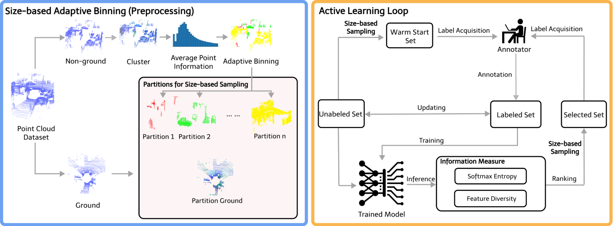

# Hi there, I'm Jiarong Wei 👋

## About Me

I'm Jiarong Wei and I come from China. I'm now an industrial PhD student working on environment semantics of automated parking in Munich, Germany. I'm coadvised by professor [Abhinav Valada](https://rl.uni-freiburg.de/people/valada) leading the [Robot Learning Lab](https://rl.uni-freiburg.de/) of [Univeristy of Freiburg](https://uni-freiburg.de/) and [Christian, Feist](https://www.linkedin.com/in/christian-feist-a5b07837/) who is a project manager in [CARIAD SE, Volkswagen Group](https://cariad.technology/). I'm interested in robust and efficient perception for autonomous vehicles. 

For my master's study, I major in Robotics in [Delft University of Technology](https://www.tudelft.nl/en/) in the Netherlands. I completed my master's thesis in the [Intelligent Vehicles group](https://intelligent-vehicles.org/) led by professor [Dariu M. Gavrila](https://www.tudelft.nl/staff/d.m.gavrila/?cHash=7fcc39a49e401f88f2823de2bfbd2bb9) under the supervision of assistant professor [Holger Caesar](https://www.tudelft.nl/staff/h.caesar/?cHash=885f8c1a5d5c1ef3722fa6c1a4aa2984). My thesis topic is 'Active Learning for LiDAR Semantic Segmentation'.

I got my bachelor's degree in [Jilin University](https://www.jlu.edu.cn/) in China majoring in Automotive Engineering. My research in my undergraduate's study focuses on the modeling and testing of automotive structure under the supervision of professor [Haitao Min](http://auto.jlu.edu.cn/info/1145/1428.htm) and professor [Tianfei Ma](http://auto.jlu.edu.cn/info/1145/1660.htm).

## Skills and Technologies
- **Programming**: Python, C++, MATLAB
- **Frameworks and Tools**: ROS, Gazebo, PyTorch, TensorFlow, Mujoco, Arduino
- **Other Skills**: CATIA, CAD, Adams, Hypermesh, Abaqus

## Projects
### Project 1 - Paper - LiDAR Perception & Machine Learning (Active Learning)([Delft University of Technology](https://www.tudelft.nl/en/), 2023.9)
### [BaSAL: Size-Balanced Warm Start Active Learning for LiDAR Semantic Segmentation](https://arxiv.org/abs/2310.08035) - [ICRA 2024](https://2024.ieee-icra.org/)
**Framework**

  

**Contribution**
- Based on the insight that it is non-trivial to sample objects according to their class, we instead propose a method that addresses class imbalance by sampling object clusters according to their size.
- We initialize the active learning loop by equally distributing the labeling budget to all size-based partitions and then randomly drawing samples from each partition, thus addressing the cold start problem.
- Our experiments demonstrate that BaSAL outperforms the state-of-the-art in active learning on SemanticKITTI and matches it on nuScenes.

**Code: https://github.com/WEIJIARONG99/BaSAL**

### Project 2 - Intern Project - LiDAR Perception & Autolabeling ([CARIAD China, Volkswagen Group](https://m.volkswagengroupchina.com.cn/en/brands/cariadchina), 2024.4)(P2+)
**Description**

My task is to develop a 3D object detection solution from scratch for the new LiDAR mounted on the test car. I'm responsible for the technical solution for point cloud dataset collection, point cloud annotation, 3D object detection, and domain adaptation. I work together with colleagues in CARIAD China and AVL China.

**Contribution**

- Make rules for point cloud dataset collection and point cloud annotation
- Develop the 3d object detection algorithm to be used in the test car LiDAR
- Build an autolabeling framework to autolabel the collected raw point clouds
- Use the autolabeled point clouds to train the 3d object detection model

### Project 3 - Lely Husky Robot Project ([Delft University of Technology](https://www.tudelft.nl/en/), 2022.7)(9.5/10)
**Description**

The Lely Husky Robot Project aims to develop a software solution from scratch for a Husky robot to clean the farm. We combines perception, navigation, planning, motion control, and human-robot interaction modules together. I'm the perception engineer responsible for robust perception and mapping of the environment.

**Contribution**
- Produce the occupancy map and use a top-view camera to detect the robot and the moving obstacles 
- Collaborate effectively with the global path planning engineer and the local motion control engineer
- Build the real-world experiment environment and test the solution made in the simulation environment
- Write the detailed solution manual, and recognized by Lely as the best team and the best solution

### Project 4 - Storm Robot Manipulator Project ([Delft University of Technology](https://www.tudelft.nl/en/), 2022.3)(9.5/10)
**Description**

The Storm Robot Manipulator Project aims to navigate a robot manipulator to a target position and drive the robot arm to fetch a bottle. We builds a mobile manipulator from scratch and develop our planning and control algorithms.

**Contribution**
- Build the kinematic model about the mobile manipulator, and model it in Mujoco environment using xml language 
- Use Stanley Controller algorithm for the mobile manipulator to accurately track the global planning path

## Experience
### Industrial PhD student at [CARIAD SE, Volkswagen Group](https://cariad.technology/)
**Dates**: 2024.6.3 - now  

### Internship at [CARIAD China, Volkswagen Group](https://m.volkswagengroupchina.com.cn/en/brands/cariadchina)
**Dates**: 2024.1.1 - 2024.4.20  
**Algorithm Engineer**

## Education
### Industrial PhD student in [CARIAD SE, Volkswagen Group](https://cariad.technology/) & [Univeristy of Freiburg](https://uni-freiburg.de/)
**Dates**: 2024.6.3 - now 

### MSc Robotics in [Delft University of Technology](https://www.tudelft.nl/en/)
**Dates**: 2021.9.1 - 2023.5.24

### Bachelor Vehicle Engineering in [Jilin University](https://www.jlu.edu.cn/)
**Dates**: 2017.9.1 - 2021.6.30

## Contact
- **Email**: weijiarong12345@gmail.com
- **LinkedIn**: 

<!-- ## 📄 Curriculum Vitae
- [Check out my CV!](files/Jiarong_CV.pdf) -->
